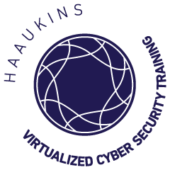

<p align="center"> 

<div align="center">
<a href="https://alpha.haaukins.com">
  
  </a>
  <a href="https://www.blackhat.com/eu-19/arsenal/schedule/#haaukins-a-highly-accessible-and-automated-virtualization-platform-for-security-education-18208">
    
  <a href="https://travis-ci.com/aau-network-security/haaukins">
    
  </a>
  <a href="https://goreportcard.com/badge/github.com/aau-network-security/haaukins">
    
  </a>
  <a href="https://github.com/aau-network-security/haaukins/releases">
    
  </a>
   <a href="https://www.gnu.org/licenses/gpl-3.0Â">
    
  </a>
  <div align ="center">
  <a href="https://github.com/aau-network-security/haaukins/issues">
  
  
  </a>
  <a href="https://github.com/aau-network-security/haaukins/network/members">
  
  </a>
  <a href="https://github.com/aau-network-security/haaukins/stargazers">
  </a>
  </div>
   
 </div>
&nbsp;
<div align="center">
<h1>Haaukins </h1>
</div>

Haaukins is a highly accessible and automated virtualization platform for security education, it has three main components (Docker, Virtualbox and Golang), the communication and orchestration between the components managed using Go programming language. The main reason of having Go environment to manage and deploy something on Haaukins platform is that Go’s easy concurrency and parallelism mechanism. 

Our primary aim to involve anyone who desire to learn capturing the flag concept in cyber security which is widely accepted approach to learn how to find vulnerability on a system. Despite of all existing platform, Haaukins provides its own virtualized environment to you with operating system which designed to find vulnerabilities

- [__Prerequisites__](#prerequisites)
- [__Installation__](#installation)
- [__Getting Dependencies__](#getting-dependencies)
- [__Testing__](#testing)
- [__Re-compile proto__](#re-compile-proto)
- [__Version release__](#version-release)
- [__Deployment__](#deployment)
- [__Known issues__](#known-issues)
- [__Contributing__](#contributing)
- [__Event requests__](#event-requests)
- [__Credits__](#credits)  
- [__License__](#license)


## __Prerequisites__

The following dependencies are required and must be installed separately in order to run daemon in your local environment.

* Linux 
* Docker
* Go 1.13+

There is no prerequisites for installing client to your environment. 

> **Note**: Linux can be used in virtualized environment as well.

## __Installation__

Use documentation page for installation, other connected repositories and more through documentation site ; https://docs.haaukins.com

## __Getting Dependencies__

Haaukins platform uses `go modules` since version [1.6.4](https://github.com/aau-network-security/haaukins/releases/tag/1.6.4), hence it is quite easy to manage dependencies, you just need to run `go mod download` 

## __Testing__

Make sure that you are in `$GOPATH/src/github.com/aau-network-security/haaukins/` directory, to run all test files, following command can be used

```bash
go test -v --race  ./...
```

## __Re-compile proto__

Haaukins platform uses gRPC on communication of client and daemon, so after updating the protocol buffer specification (i.e. daemon/proto/daemon.proto), corresponding golang code generation is done by doing the following:
```bash
cd $GOPATH/src/github.com/aau-network-security/haaukins/daemon/
protoc -I proto/ proto/daemon.proto --go_out=plugins=grpc:proto
```

## __Version release__

GoReleaser is handling release section, just tag the commit. 

## Deployment 

Travis automatically deploys on `server`.

Note: by default the script uses the `~/.ssh/id_rsa` key to push to GitHub.
You can override this settings by the `HKN_RELEASE_PEMFILE` env var.

## __Known issues__

Give a  moment and check known issues over [here](https://github.com/aau-network-security/haaukins/issues)

## __Contributing__

Haaukins is an open source project and built on the top of open-source projects. If you are interested, then you are welcome to contribute.

Check out the [Contributing Guide](.github/CONTRIBUTING.md) to get started.

## __Event requests__

As AAU, we believe in power of open source community and would like to offer test our platform for organizations and users , if you would like to get your own domain which will be assigned by us please contact us in advance.

## __Credits__

  - Logo designed by [indepedenthand](https://www.behance.net/independenthand)

## __License__

[GNU](https://github.com/aau-network-security/haaukins/blob/master/LICENSE)

Copyright (c) 2019-present, Haaukins
